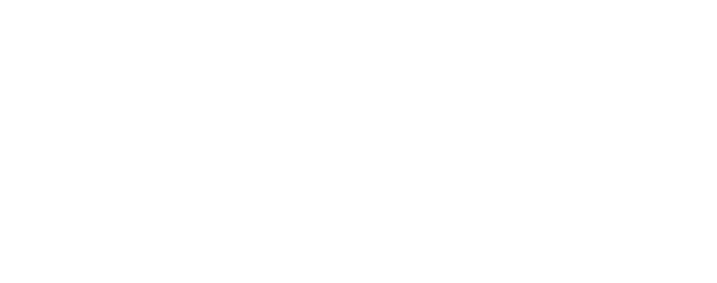

<h1 align="center">
  
</h1>
 

  <a href="#-tecnologias">Tecnologias</a>&nbsp;&nbsp;&nbsp;|&nbsp;&nbsp;&nbsp;
  <a href="#-projeto">Projeto</a>&nbsp;&nbsp;&nbsp;|&nbsp;&nbsp;&nbsp;
  <a href="#-layout">Challenge</a>&nbsp;&nbsp;&nbsp;|&nbsp;&nbsp;&nbsp;
  <a href="#-autor">Autor</a>&nbsp;&nbsp;&nbsp;

 

## ✨ Preview

## 🚀 Tecnologias

Esse projeto foi desenvolvido com as seguintes tecnologias:

- HTML
- CSS
- JavaScript

## 💻 Projeto

Projeto feito para treinar validações de forms e também a implementação de layouts.

## 🔖 Challenge

A ideia desta aplicação é de um site de desafios para programadores: <a href="https://www.devchallenge.com.br/challenges/5f261924ecb9243236c05385/details">DevChallenge</a>.

## 👨‍💻 Autor

- Github: <a href="https://github.com/">MrEzequiel
  </a>
- Instagram: <a href="https://www.instagram.com/ezequield3v/">@ezequield3v</a>

 
<h2 align="center">Feito com ♥ por Ezequiel ⭐️</h2>
